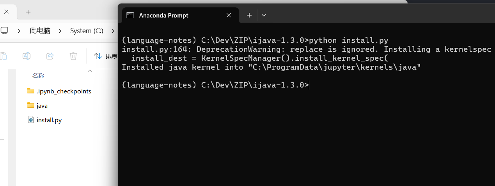
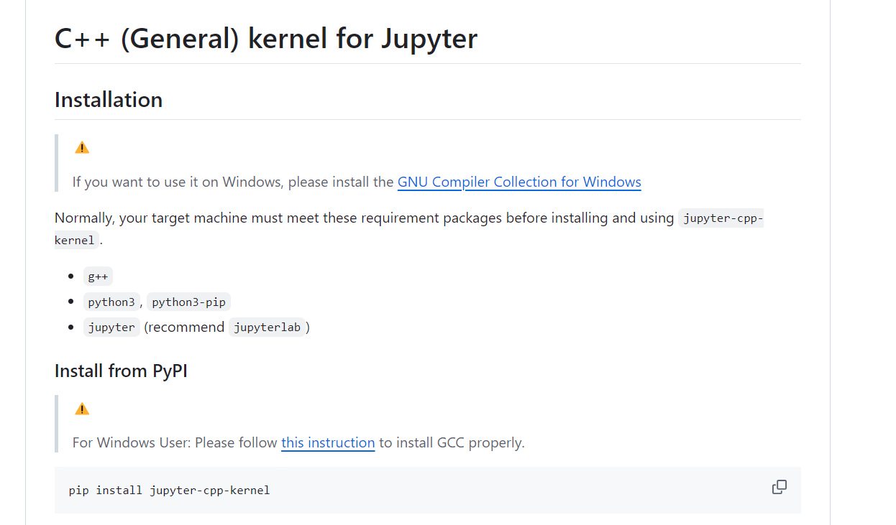

## Language Notes

**自用**，语言、框架、数据结构、设计模式等学习笔记（B站视频），jupyter notebook 格式。

> 如何内核扩展使用请去 [https://github.com/jupyter/jupyter/wiki/Jupyter-kernels](https://github.com/jupyter/jupyter/wiki/Jupyter-kernels)

### Java 内核

### C/CPP 内核

2024 笔记

Blog [Shey's Blog](https://z-shey.github.io)